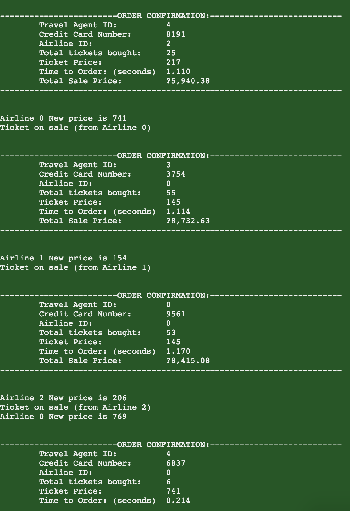

# Travel-Agency
Simulates a Travel Agency that sells tickets to Customers from an Airline

Implements concurrent threading to simulate multiple travel agencies.  The travel agencies will purchase from a pool of tickets when they go on sale. 

Coded with C#

